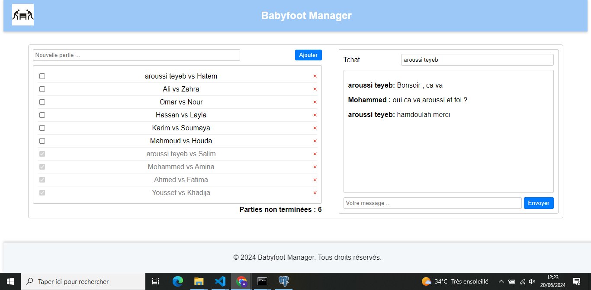
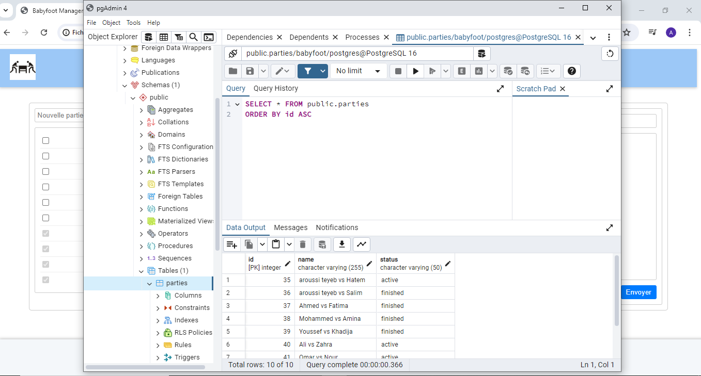

## BabyFoot Manager

### Description

BabyFoot Manager est une application web de type RIA permettant de créer des parties de babyfoot. Sa particularité sera de pouvoir créer des parties de manière collaborative.

### Capture d'écran de l'Interface



### Capture d'écran de la Base de Données PostgreSQL



### Technologies Utilisées

#### Backend

- Node.js
- Express.js
- PostgreSQL
- WebSocket (ws)

#### Frontend

- JavaScript (pur)

#### Base de données

- PostgreSQL

### Installation et Configuration

#### Configuration du Backend

1. **Clonage du dépôt**
   Clonez le dépôt sur votre machine locale :

   ```
   git clone https://github.com/aroussiteyeb/test-technique/tree/main/backend
   cd backend
   ```

2. **Installation des dépendances**
   Naviguez jusqu'au répertoire backend et installez les packages npm nécessaires :

   ```
   npm install
   ```

3. **Configuration de PostgreSQL**

   - Installez PostgreSQL sur votre machine et assurez-vous qu'il est en cours d'exécution.
   - Créez une base de données PostgreSQL et notez les détails de connexion (nom d'utilisateur, mot de passe, nom de la base de données, port).

4. **Configurer la connexion à la base de données**
   Ouvrez le fichier index.js dans votre éditeur de texte et mettez à jour les détails de connexion PostgreSQL :

   ```javascript
   const pool = new Pool({
     user: "votreutilisateur",
     host: "localhost",
     database: "votredatabase",
     password: "votremotdepasse",
     port: 5432,
   });
   ```

5. **Démarrer le serveur Backend**
   Lancez le serveur Node.js avec "nodemon":
   ```
   nodemon index.js
   ```
   Le serveur sera accessible à l'adresse http://localhost:3000.

#### Configuration du Frontend

1. **Clonage du dépôt**
   Clonez le dépôt sur votre machine locale :
   ```
   git clone https://github.com/aroussiteyeb/test-technique/tree/main/FrontEnd
   ```
2. **Naviguez jusqu'au répertoire frontend**

   ```
   cd ../frontend
   ```

3. **Exécuter l'application**
   Ouvrez le fichier index.html dans votre navigateur web.

### Utilisation

- Créer une partie: Entrez un nom de partie dans le champ de texte et cliquez sur "Ajouter".
- Terminer une partie: Cochez la case à côté d'une partie active pour la marquer comme terminée.
- Supprimer une partie: Cliquez sur la croix rouge à côté d'une partie pour la retirer de la liste.
- Chat: Entrez votre nom dans le champ "Pseudo" et commencez à discuter avec les autres participants. Chaque discussion est indépendante et constitue une "room" de chat distincte.

### D’autres idées ?

- L'application comporte un header et un footer avec un logo.

### Notes Supplémentaires

- Cette application ne nécessite pas d'authentification utilisateur.
- Assurez-vous que Node.js, PostgreSQL et WebSocket (ws) sont correctement
  configurés et en cours d'exécution avant de démarrer l'application.

### structure backend

```
my-project/
├── src/
│   ├── controllers/
│   │   ├── partiesController.js
│   │   └── chatController.js
│   ├── models/
│   │   ├── partyModel.js
│   │   └── chatMessageModel.js
│   ├── routes/
│   │   ├── partiesRoutes.js
│   │   ├── chatRoutes.js
│   │   └── index.js
│   ├── services/
│   │   ├── partyService.js
│   │   └── chatService.js
│   ├── utils/
│   │   └── websocket.js
│   ├── app.js
│   └── db.js
├── test/
│   ├── unit/
│   └── integration/
├── config/
│   ├── env.js
│   └── config.js
├── .gitignore
├── package.json
├── README.md
└── index.js
```
